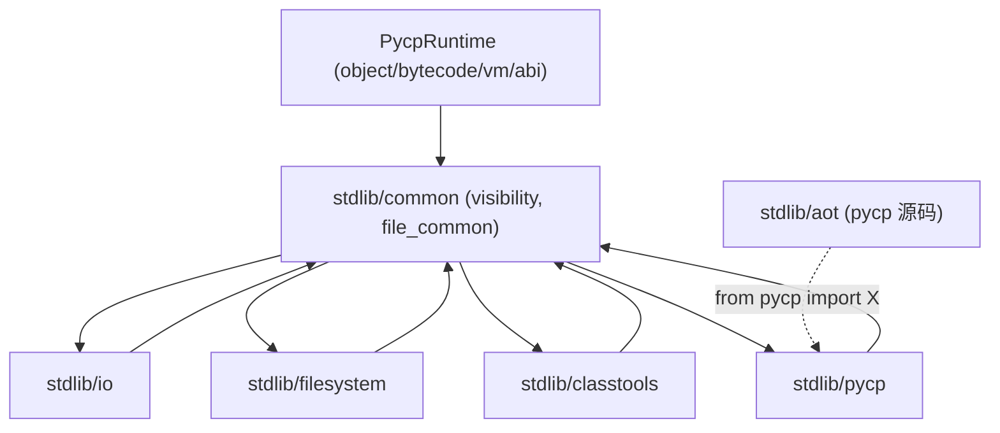

# Pycp stdlib C++ 重构设计（集中存放 + 抽取公共部分 + CMake 分库）

> 状态：**设计稿（供评审）**。本轮只产出文档，不改动任何 C++/CMake/pycp 源码。
> 目标：将 stdlib 的 C++ 实现「集中存放 + 共性抽取」，用 CMake 控制各模块生成动态库/静态库；
> 并给出 AOT 模块改用 `from pycp import String` 类导入的改造方案。

---

## 0. 现状与目标

### 0.1 现状（均附出处）
- stdlib 目录：`src/stdlib/{io, pycp, classtools, moduletools, ast, bytecode, filesystem, aot}`（`add_subdirectory(src/stdlib)` 见 `CMakeLists.txt:138`）；**新增 `maths`（数值数学库，见 `docs/CORE_METHODS.md` §13，本轮仅设计）**。
- 每模块布局：`include/<x>.hpp` + `src/<x>.cpp` + `CMakeLists.txt`；构建采用「OBJECT(动态) + OBJECT(静态, `-DPYCP_STATIC`) + SHARED + STATIC」四目标（模板见 `src/stdlib/io/CMakeLists.txt`、`src/stdlib/pycp/CMakeLists.txt`）。
- 目标收集：各子库 `set_property(GLOBAL APPEND PROPERTY PYCP_STDLIB_TARGETS/PYCP_STDLIB_STATIC_TARGETS …)`，顶层取出（`CMakeLists.txt:142-144`）并生成 dist 文件清单（`CMakeLists.txt:317-327`），由 `cmake/PycpDist.cmake` 的 `pycp-dist` 复制到 `dist/stdlib/`、`dist/lib/`。
- **重复实现（本次抽取目标 #1）**：`private`/`public`/`readonly` 装饰器在 `src/stdlib/classtools/src/classtools.cpp:60-106,116-120` 与 `src/stdlib/pycp/src/PycpModule.cpp:381-421,545-549` **逐字重复**（函数体、参数规范、异常消息一致），注释亦自述「功能完全一致」。
- **共享逻辑（本次抽取目标 #2）**：`File` 的实现位于运行时 `src/object/PycpFile.{hpp,cpp}`（`File_method_table` `:478`、`FileConstructor` `:500`、`FileTypeClass` `:517`），由 `io`（`src/stdlib/io/src/io.cpp:197-201`）与 `filesystem`（`src/stdlib/filesystem/src/PycpFilesystemModule.cpp:213-217`）**各自**绑定别名到模块命名空间（`set_object("File", …)`）。
- 纯 pycp 标准库包：`src/stdlib/aot`（模块文件夹 `package.mpycp`），经 `PYCP_DIST_STDLIB_PACKAGE_DIRS`（`CMakeLists.txt:368`）整体复制到 `dist/stdlib/aot/`。

### 0.2 目标
1. 新增 `src/stdlib/common/`，把「被 ≥2 个模块复用」的共性实现集中于此（File 绑定样板、private/public/readonly）。
2. 用 CMake 让 common 以「动态 OBJECT + 静态 OBJECT」提供，各模块聚合后仍各自产出动态库/静态库；**保持 dist 收集契约不变**。
3. AOT 模块（pycp 源码）改用 `from pycp import X`。

### 0.3 抽取判据（避免过度集中）
> **仅当某实现被 ≥2 个模块复用，才抽取到 common。**

| 候选 | 复用者 | 结论 |
|---|---|---|
| `private`/`public`/`readonly` | classtools、pycp | ✅ 抽取 |
| File 模块绑定样板（`FileTypeClass` 别名注册） | io、filesystem | ✅ 抽取（薄封装） |
| `super` | 仅 classtools | ➖ 暂不抽取 |
| io 的 stdout / filesystem 路径工具 | 各 1 处 | ➖ 暂不抽取 |

---

## 1. 目标布局

```text
src/stdlib/
├── common/                     # [NEW] 共性实现（编译进各模块，不单独产出可加载模块）
│   ├── include/
│   │   ├── visibility.hpp      # private/public/readonly 声明与注册辅助
│   │   └── file_common.hpp     # File 类型类模块绑定辅助（BindFileType）
│   ├── src/
│   │   ├── visibility.cpp
│   │   └── file_common.cpp
│   └── CMakeLists.txt
├── io/ pycp/ classtools/ moduletools/ ast/ bytecode/ filesystem/   # 保留各自 src/ 与 include/
├── maths/                      # [NEW，见 CORE_METHODS §13] 数值数学库（原生扩展，四目标模式）
└── aot/                        # 纯 pycp 包（不改目录结构）
```

依赖关系：



---

## 2. common 的公共接口（契约）

### 2.1 `visibility.hpp`
```cpp
#pragma once
#include "object/PycpMethodTable.hpp"   // PycpCFunction 等
namespace Pycp {
class Object; class FixedList; class Map; class Module;

// 装饰器实现（语义与现状逐字一致）
Object* BuiltinPrivate (Object* self, FixedList* args, Map* kwargs);  // @private
Object* BuiltinPublic  (Object* self, FixedList* args, Map* kwargs);  // @public
Object* BuiltinReadonly(Object* self, FixedList* args, Map* kwargs);  // @readonly

// 统一注册：private/public/readonly 一次性挂到给定模块
void RegisterVisibilityDecorators(Module* mod);
}
```

### 2.2 `file_common.hpp`
```cpp
#pragma once
namespace Pycp {
class Module;
// 把「运行时唯一的 File 类型类」绑定到给定模块的 File 名字上（io/filesystem 共用）。
// 内部调用 FileTypeClass()（src/object/PycpFile.cpp:517）并 set_object("File", …)。
void BindFileType(Module* mod);
}
```

> 说明：File 的**实现**（方法、构造、类型类）保持在运行时 `src/object/PycpFile.*`——这保证新增/既有方法对所有程序（含 AOT 产物）可用；common 只统一「把 File 暴露到 stdlib 模块」的样板。

---

## 3. CMake 设计

### 3.1 方案选择
| 方案 | 做法 | 优点 | 代价 |
|---|---|---|---|
| **A（推荐）OBJECT 聚合** | common 只产 OBJECT（动态/静态两套）；各模块把 common 的 OBJECT 编入自身 SHARED/STATIC | 不改 `PYCP_STDLIB_TARGETS`/`pycp-dist` 契约；common 不产生运行时产物；无跨 DLL 导出问题 | common 头改动触发多模块重编 |
| B 独立库 | common 产 `libPycpCommon.{so,a}`，各模块链接 | 模块更薄 | 需新增 dist 收集与 rpath；Windows 需显式导出符号；复杂度高 |

**采用方案 A。**

### 3.2 `src/stdlib/common/CMakeLists.txt`（目标）
```cmake
# 共性实现：两套 OBJECT（动态 dllimport / 静态 PYCP_STATIC），供各模块聚合。
set(COMMON_SOURCES
    ${CMAKE_CURRENT_SOURCE_DIR}/src/visibility.cpp
    ${CMAKE_CURRENT_SOURCE_DIR}/src/file_common.cpp
)
set(COMMON_HEADERS
    ${CMAKE_CURRENT_SOURCE_DIR}/include/visibility.hpp
    ${CMAKE_CURRENT_SOURCE_DIR}/include/file_common.hpp
)

add_library(PycpBuiltin_common_obj OBJECT ${COMMON_SOURCES} ${COMMON_HEADERS})
target_include_directories(PycpBuiltin_common_obj PUBLIC
    ${CMAKE_CURRENT_SOURCE_DIR} ${CMAKE_CURRENT_SOURCE_DIR}/include ${CMAKE_CURRENT_SOURCE_DIR}/../..)
set_target_properties(PycpBuiltin_common_obj PROPERTIES POSITION_INDEPENDENT_CODE ON)

add_library(PycpBuiltin_common_obj_static OBJECT ${COMMON_SOURCES} ${COMMON_HEADERS})
target_include_directories(PycpBuiltin_common_obj_static PUBLIC
    ${CMAKE_CURRENT_SOURCE_DIR} ${CMAKE_CURRENT_SOURCE_DIR}/include ${CMAKE_CURRENT_SOURCE_DIR}/../..)
target_compile_definitions(PycpBuiltin_common_obj_static PUBLIC PYCP_STATIC)
set_target_properties(PycpBuiltin_common_obj_static PROPERTIES POSITION_INDEPENDENT_CODE ON)

# 注意：common 不注册 PYCP_STDLIB_TARGETS（它不是可加载模块）。
```

### 3.3 各模块 CMake 改造（以 io 为例）
```cmake
# 原有 PycpBuiltin_io_obj / _obj_static 保留；
# 仅在聚合 common 对象时加入：
add_library(PycpBuiltin_io_shared SHARED
    $<TARGET_OBJECTS:PycpBuiltin_io_obj>
    $<TARGET_OBJECTS:PycpBuiltin_common_obj>)
add_library(PycpBuiltin_io_static STATIC
    $<TARGET_OBJECTS:PycpBuiltin_io_obj_static>
    $<TARGET_OBJECTS:PycpBuiltin_common_obj_static>)
# 链接、rpath、注册（PYCP_STDLIB_TARGETS / _STATIC_TARGETS）均不变。
```
其余模块（pycp/classtools/filesystem/moduletools/ast/bytecode）按需照此加入 common 对象；
仅真正复用 common 的模块才聚合它（io/filesystem 用 file_common，classtools/pycp 用 visibility）。

**新增 `maths` 模块**：直接复制 `io` 的四目标模式建立 `src/stdlib/maths/`，并在 `src/stdlib/CMakeLists.txt` 添加 `add_subdirectory(maths)`；
它**不**复用 common（无 File/visibility 共性），故不聚合 common 对象。其 API 设计（按 Integer/Float/Decimal 区分）见 `docs/CORE_METHODS.md` §13。

### 3.4 目标图（改造后不变的部分）
- `dist/stdlib/*.{so,dll,dylib}`：仍由 `PYCP_STDLIB_TARGETS` 收集，**不新增/不删除**任何条目。
- `dist/lib/libPycpExt_*.a`：仍由 `PYCP_STDLIB_STATIC_TARGETS` 收集，不变。
- `dist/stdlib/aot/`：不变（`PYCP_DIST_STDLIB_PACKAGE_DIRS`）。
- 结论：**`cmake/PycpDist.cmake` 与顶层收集逻辑无需修改**。

---

## 4. 去重改造步骤

### 4.1 visibility（private/public/readonly）
1. 新建 `common/include/visibility.hpp` 与 `common/src/visibility.cpp`：把 `classtools.cpp:60-106` 的实现**逐字迁移**（含异常消息 `"visibility decorator expects exactly 1 argument."` / `"readonly decorator expects exactly 1 argument."` 与参数规范 `CompileArgs("private"|"public"|"readonly", { Required("target") })`）。
2. 抽出 `RegisterVisibilityDecorators(Module*)`：内部 `mod->set_function("private", BuiltinPrivate) … ` 三连（顺序与现状一致）。
3. `classtools.cpp`：删除本地实现，改为 `RegisterVisibilityDecorators(mod);` 并保留 `super`。
4. `PycpModule.cpp`：删除本地实现（`:381-421`），改为 `RegisterVisibilityDecorators(mod);`（位置保持在 `:545-549` 处）。

### 4.2 File
1. 新建 `common/src/file_common.cpp` 实现 `BindFileType(Module*)`：
   `Class* cls = FileTypeClass(); Incref(cls); mod->set_object("File", cls);`（与 `io.cpp:197-201` / `filesystem:213-217` 等价）。
2. `io.cpp` / `PycpFilesystemModule.cpp`：把三行样板替换为 `BindFileType(mod);`。

### 4.3 迁移顺序（保证每步可构建）
`common 骨架` → `visibility 去重` → `file_common 去重` → `各模块 CMake 聚合 common` → `清理 dist 旧产物` → `回归`。

---

## 5. 风险与对策

| 编号 | 风险 | 对策 |
|---|---|---|
| R1 | 同名符号在多扩展中重复（ODR） | common 函数放在 `namespace Pycp` + 头声明；不导出（不 `PYCP_API`），仅扩展内部链接可见；实现细节可置于匿名命名空间 |
| R2 | `PYCP_API` 在 Windows 默认 `dllimport`，静态库版需 `PYCP_STATIC` | 维持**两套 OBJECT**（动态保持 dllimport，静态 `-DPYCP_STATIC`），与既有 io/pycp 注释同因 |
| R3 | `PYCP_EXPORT_MODULE` 入口归属 | common **不得**定义/导出模块入口；入口仍在各扩展 `.cpp` |
| R4 | Windows DLL 无显式导出导致符号找不到 | 采方案 A（OBJECT 聚合），common 不产 DLL，规避该坑 |
| R5 | dist 残留旧产物 | `file(COPY)` 不删旧文件；改造后需清理 `build/dist`（历史已出现 `pycp.mmycp`/`pycp.mpycp` 残留），见 §8 验证 |
| R6 | rpath / 链接依赖变化 | OBJECT 聚合不引入新的链接依赖，rpath 规则不变 |
| R7 | 增量构建范围变大 | common 头被多模块 include，改动会触发多模块重编；建议保持头极简 |
| R8 | 行为漂移 | 去重后 `private/public/readonly` 的参数规范、异常消息、返回语义必须逐字保持（以现状为基准做等价测试） |

---

## 6. AOT `from pycp import X` 改造方案

### 6.1 可导入名核对（`pycp` 模块当前导出，`src/stdlib/pycp/src/PycpModule.cpp:515-569`）
- **类型（`set_type`）**：`String`、`Integer`、`Boolean`、`Float`、`Decimal`、`List`、`FixedList`、`Map`、`Object`
- **函数（`set_function`）**：`private`、`public`、`readonly`、`insp`、`typeof`、`exec`
- **变量**：`argv`
- 结论：AOT 需要的 `String`/`List`/`Map` **均已可作为模块属性导入**，`from pycp import String, List, Map` 可行。

### 6.2 用法替换（实测位置）
| 现状 | 改后 | 位置 |
|---|---|---|
| `pycp.String(x)` | `String(x)` | `src/stdlib/aot/util.pycp:14` |
| `pycp.List()` | `List()` | `sdk.pycp`（44,89,90,92,112,124,137,170,190）、`plan.pycp`（63）、`emit.pycp`（986 等）、`project.pycp`（59,61,107,394）、`package.mpycp`（159,207,208,209,233,240,262,269,285,296…） |
| `pycp.Map()` | `Map()` | `sdk.pycp`（80,91,188）、`plan.pycp`（23,24,90）、`project.pycp`（55,60,116,122）、`package.mpycp`（131,183,227,274,314…） |
| `import pycp` | `from pycp import String, List, Map`（按文件实际用到的名字裁剪） | 上列各文件头部 |

> **不要改动**：`src/stdlib/aot/emit.pycp:561` 的字符串字面量 `parent_ref = "pycp.Object"`（这是**生成代码里的默认父类名文本**，不是模块调用）；`util.pycp:12` 的注释文本 `// pycp.String 的简写`。

### 6.3 语义与验收
- `from pycp import X` 与 `pycp.X` 取到的是**同一对象**（模块命名空间中的类型类），调用语义完全一致。
- AOT 只是**书写风格**变化，**不影响生成产物**；验收：改造前后 `pycp -m aot` / `--emit-cpp` 对同一输入产出的 `.gen.cpp` 与 `CMakeLists.txt` **逐字节一致**。
- 残留检查：改造后 `src/stdlib/aot/**` 中除上述两处例外外，不应再有 `pycp.` 前缀调用。

---

## 7. 交付物与不在本轮范围
- 本轮**只写文档**：`docs/STDLIB_REFACTOR.md`（本文）+ `docs/CORE_METHODS.md`。
- **不**修改任何 `src/**`、`cmake/**`、`CMakeLists.txt`、`.pycp/.mpycp`。

---

## 8. 验收清单（供实现轮使用）
- [ ] `src/stdlib/common/{include,src,CMakeLists.txt}` 建立，动态/静态两套 OBJECT 编译通过。
- [ ] `classtools` 与 `pycp` 的 `private/public/readonly` 改为复用 common，行为等价（参数规范/异常消息/返回一致）。
- [ ] `io` 与 `filesystem` 的 File 绑定改为 `BindFileType(mod)`。
- [ ] `PYCP_STDLIB_TARGETS` / `PYCP_STDLIB_STATIC_TARGETS` 条目集合不变，`pycp-dist` 输出结构不变。
- [ ] `build/dist` 无旧产物残留（`pycp.mmycp`/`pycp.mpycp` 等）。
- [ ] AOT 模块 `from pycp import X` 改造后，产物与改造前**逐字节一致**。
- [ ] `tests/**` 解释器用例回归通过；AOT 端到端（生成→构建→运行）通过。
